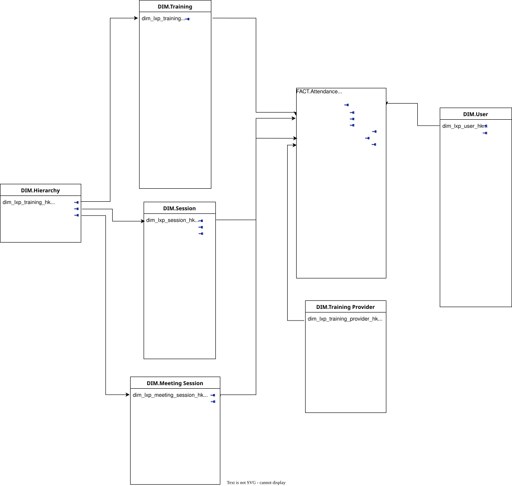

# References & Metrics

This section serves as the project's single source of truth for business logic and data definitions.

## Schema

## Data Dictionary

A description of the schema for key datasets, especially those in `data/processed/` and `sql/marts/`.

| Table Name      | Column Name | Data Type | Description                               |
|-----------------|-------------|-----------|-------------------------------------------|
| `dim_users`     | `user_id`   | `int`     | Unique identifier for the user.           |
| `dim_users`     | `signup_dt` | `date`    | The date the user created their account.  |
| `fact_activity` | `event_id`  | `uuid`    | Unique identifier for the event.          |
| `fact_activity` | `user_id`   | `int`     | Foreign key to the `dim_users` table.     |
| ...             | ...         | ...       | ...                                       |

## Metric Definitions

A list of key performance indicators (KPIs) and their precise calculation logic.

**Monthly Active Users (MAU)**

- **Description**: The count of unique users who performed a key action (e.g., logged in, viewed a page) within a calendar month.

- **Logic**: `COUNT(DISTINCT user_id) FROM fact_activity WHERE activity_month = 'YYYY-MM'`

- **Owner**: Analytics Team